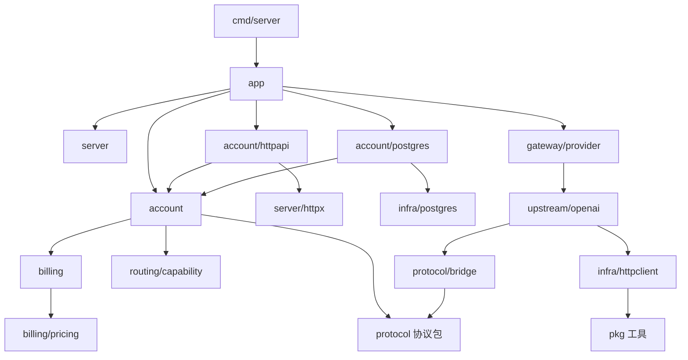
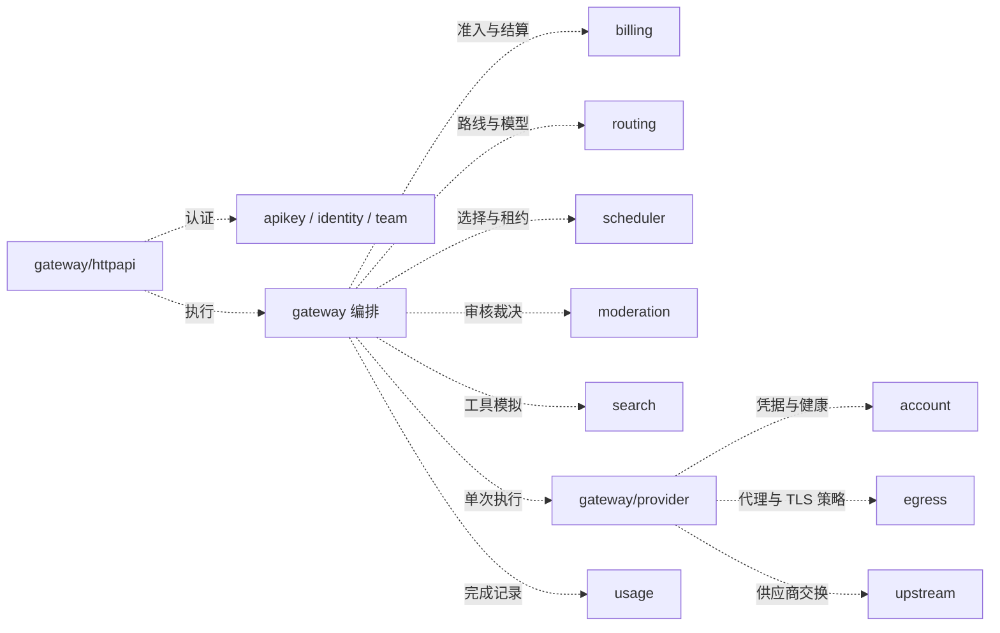
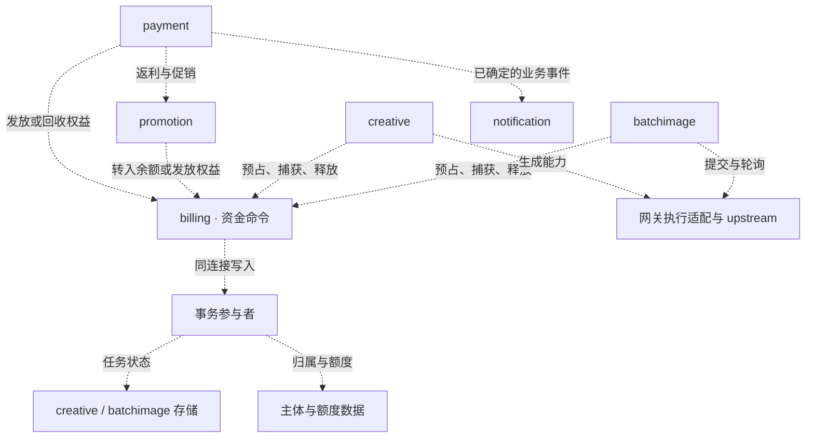
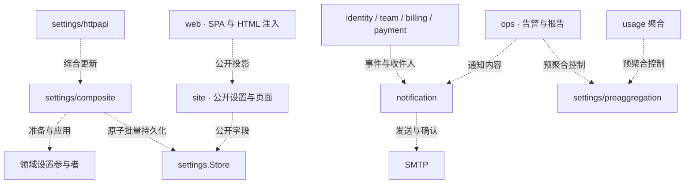

# 后端模块地图

本文列出当前后端包的职责、静态依赖方向与主要运行协作，供定位代码和判断变更归属时使用。图中省略外部 Go 库、测试依赖和同层细节；业务规则由各专题说明。

## 章节导航

- [目录与包职责](#package_map)：从包名查找职责。
- [模块内部约定](#module_adapters)：判断核心、适配和测试代码应放在哪里。
- [静态依赖](#static_dependencies)：查看 Go import 方向和约束。
- [网关协作](#gateway_collaboration)：查看请求处理涉及的模块。
- [资金与任务协作](#funding_collaboration)：查看事务、权益和任务完成边界。
- [管理与后台协作](#management_collaboration)：查看设置、通知和观测的关系。
- [模块专题导航](#module_topics)：进入规则和运行专题。

<a id="package_map"></a>
## 目录与包职责

以下路径相对仓库根。每个含手写 Go 代码的包均有一行说明，包括只在特定构建标签或平台下使用的包，以及测试包。`infra`、`pkg`、`upstream/internal` 是分类目录；Ent 生成子包合并显示。目录同级不代表可以任意相互导入。

```text
backend/
├── cmd/                                                 可执行命令入口
│   ├── cleanup-ingress-reject-logs/                     历史入口拒绝日志的清理命令
│   ├── jwtgen/                                          JWT 辅助命令
│   └── server/                                          服务器参数、版本信息与 app 启动
├── internal/                                            应用内部包；受 Go 导入范围约束
│   ├── account/                                         上游账号、凭据、授权、健康和维护
│   │   ├── httpapi/                                     HTTP 路由、鉴权接入与输入输出适配
│   │   │   └── dto/                                     HTTP 展示值、请求值及脱敏映射
│   │   ├── postgres/                                    PostgreSQL 持久化及事务适配
│   │   ├── provider/                                    外部服务与技术能力适配
│   │   ├── rediscache/                                  Redis 缓存、计数或会话适配
│   │   ├── transfer/                                    账号导入、导出与 CRS 同步的传输值
│   │   └── usageview/                                   账号用量展示及 Grok 快照副本
│   ├── apikey/                                          网关 Key、认证快照、访问策略和失效传播
│   │   ├── httpapi/                                     HTTP 路由、鉴权接入与输入输出适配
│   │   │   └── dto/                                     HTTP 展示值、请求值及脱敏映射
│   │   ├── postgres/                                    PostgreSQL 持久化及事务适配
│   │   ├── rediscache/                                  Redis 缓存、计数或会话适配
│   │   └── testkit/                                     该模块测试所需的替身与夹具
│   ├── app/                                             唯一组合根、依赖绑定和运行资源登记
│   │   ├── bootstrap/                                   数据库与 Redis 引导、迁移、密钥、时区及初始数据
│   │   └── lifecycle/                                   分阶段启停、请求屏障、派生任务等待与重启
│   ├── audit/                                           管理员操作审计与审计数据清理
│   │   ├── httpapi/                                     HTTP 路由、鉴权接入与输入输出适配
│   │   └── postgres/                                    PostgreSQL 持久化及事务适配
│   ├── backup/                                          备份、恢复、归档任务及兼容管理入口
│   │   ├── httpapi/                                     HTTP 路由、鉴权接入与输入输出适配
│   │   └── provider/                                    外部服务与技术能力适配
│   ├── batchimage/                                      批量图片任务、供应商作业和恢复
│   │   ├── httpapi/                                     HTTP 路由、鉴权接入与输入输出适配
│   │   ├── postgres/                                    PostgreSQL 持久化及事务适配
│   │   ├── provider/                                    外部服务与技术能力适配
│   │   └── rediscache/                                  Redis 缓存、计数或会话适配
│   ├── billing/                                         价格计算、资金、订阅、配额和事务命令
│   │   ├── httpapi/                                     HTTP 路由、鉴权接入与输入输出适配
│   │   │   └── dto/                                     HTTP 展示值、请求值及脱敏映射
│   │   ├── postgres/                                    PostgreSQL 持久化及事务适配
│   │   ├── pricing/                                     价卡、模型价格解析、时间倍率和纯费用计算
│   │   ├── provider/                                    外部服务与技术能力适配
│   │   ├── rediscache/                                  Redis 缓存、计数或会话适配
│   │   └── testkit/                                     该模块测试所需的替身与夹具
│   ├── config/                                          启动配置加载、默认值、规范化和校验
│   ├── creative/                                        创作台任务、临时素材、结果交付和资金恢复
│   │   ├── httpapi/                                     HTTP 路由、鉴权接入与输入输出适配
│   │   ├── postgres/                                    PostgreSQL 持久化及事务适配
│   │   ├── provider/                                    外部服务与技术能力适配
│   │   └── rediscache/                                  Redis 缓存、计数或会话适配
│   ├── egress/                                          代理、TLS 策略、出站目标与故障隔离
│   │   ├── httpapi/                                     HTTP 路由、鉴权接入与输入输出适配
│   │   │   └── dto/                                     HTTP 展示值、请求值及脱敏映射
│   │   ├── postgres/                                    PostgreSQL 持久化及事务适配
│   │   ├── provider/                                    外部服务与技术能力适配
│   │   ├── rediscache/                                  Redis 缓存、计数或会话适配
│   │   └── urlpolicy/                                   上游地址、允许列表和重定向校验策略
│   ├── gateway/                                         请求准入、平台尝试、输出和完成编排
│   │   ├── admission/                                   消费资格、分组及用户平台额度准入
│   │   ├── clientmeta/                                  客户端识别、版本规则与审查亲缘线索解析
│   │   ├── compact/                                     压缩请求恢复、流观察与回退规则
│   │   ├── completion/                                  完成快照、结算、记录和有界任务池
│   │   ├── errorpolicy/                                 最终错误规则匹配、改写与配置快照
│   │   ├── execution/                                   Qoder 请求执行输入、输出与端口契约
│   │   ├── failover/                                    切号状态、重试预算与退避
│   │   ├── forward/                                     转发结果、协议准备、输出观察与失败契约
│   │   ├── httpapi/                                     HTTP 路由、鉴权接入与输入输出适配
│   │   │   ├── dto/                                     HTTP 展示值、请求值及脱敏映射
│   │   │   ├── mediaentry/                              图片、视频、音频、嵌入及搜索入口的请求适配
│   │   │   ├── openaiattempt/                           OpenAI 兼容文本入口的逐次尝试绑定
│   │   │   ├── testkit/                                 该模块测试所需的替身与夹具
│   │   │   ├── textattempt/                             Messages、通用文本与 Gemini 入口的尝试绑定
│   │   │   └── wsentry/                                 WebSocket 入站与每轮执行端口绑定
│   │   ├── live/                                        Live 创建、会话身份、模型状态和观察者编排
│   │   ├── media/                                       媒体生成、视频归属、搜索与 Realtime 用例
│   │   │   └── provider/                                媒体归属与异步计量的任务适配
│   │   ├── modeldisplay/                                公开模型目录的展示与能力投影
│   │   ├── modeltrace/                                  Key、分组、工具模型的变换追踪与响应恢复
│   │   ├── moderationflow/                              网关审核主体、Cyber 标记与完成输入
│   │   ├── postgres/                                    PostgreSQL 持久化及事务适配
│   │   ├── promptpolicy/                                用户提示词替换及运行规则缓存
│   │   ├── provider/                                    组合账号、路由、传输与平台执行的具体适配
│   │   │   ├── googleforward/                           Gemini 与 Antigravity 请求准备和协议执行适配
│   │   │   ├── grokforward/                             Grok 请求组合及 Responses 转换适配
│   │   │   ├── messageforward/                          Anthropic Messages、计数和兼容协议执行适配
│   │   │   ├── modelidentity/                           平台模型别名、推理与定价身份投影
│   │   │   ├── openaiforward/                           OpenAI 兼容文本、透传及各协议单次执行适配
│   │   │   ├── requestdebug/                            请求调试追踪和文件句柄管理
│   │   │   ├── selection/                               通用、OpenAI/Grok、Gemini 选择及诊断投影
│   │   │   └── transport/                               请求级出站策略与平台 HTTP 传输组合
│   │   ├── rediscache/                                  Redis 缓存、计数或会话适配
│   │   ├── requeststate/                                请求及尝试副本、路由提示、工具恢复与凭据预算
│   │   ├── searchtools/                                 工具识别、启用规则、搜索模拟与合成输出
│   │   ├── session/                                     会话摘要、隔离、归属、续接与推理历史
│   │   │   └── testkit/                                 该模块测试所需的替身与夹具
│   │   ├── telemetry/                                   完成观测、诊断与缺失用量采样
│   │   ├── testkit/                                     该模块测试所需的替身与夹具
│   │   ├── text/                                        文本账号循环、计数和输入 token 预检
│   │   ├── tierpolicy/                                  Fast/Flex 服务档位准入、设置与价格规则
│   │   ├── tokenestimate/                               本地 token 数估算
│   │   └── ws/                                          入站 WebSocket、turn、帧与恢复编排
│   ├── idempotency/                                     面板命令认领、重放、冲突与租约清理
│   │   ├── httpapi/                                     HTTP 路由、鉴权接入与输入输出适配
│   │   ├── postgres/                                    PostgreSQL 持久化及事务适配
│   │   └── testkit/                                     该模块测试所需的替身与夹具
│   ├── identity/                                        用户、登录身份、会话、强认证和绑定
│   │   ├── authconfig/                                  登录配置值、地址与钉钉配置解析
│   │   ├── contact/                                     邮箱规范化等联系方式纯规则
│   │   ├── httpapi/                                     HTTP 路由、鉴权接入与输入输出适配
│   │   │   ├── authctx/                                 已认证用户、会话和角色的 HTTP 上下文
│   │   │   └── dto/                                     HTTP 展示值、请求值及脱敏映射
│   │   ├── postgres/                                    PostgreSQL 持久化及事务适配
│   │   ├── provider/                                    外部服务与技术能力适配
│   │   ├── rediscache/                                  Redis 缓存、计数或会话适配
│   │   └── testkit/                                     该模块测试所需的替身与夹具
│   ├── infra/                                           数据库、网络、日志等技术实现；分类目录
│   │   ├── crypto/                                      AES 加解密
│   │   ├── httpclient/                                  共享连接池、DNS、响应上限、流缓冲与请求工具
│   │   │   ├── proxy/                                   代理地址解析、拨号与池隔离键
│   │   │   └── tlsfingerprint/                          TLS ClientHello、ALPN、指纹拨号与缓存键
│   │   ├── postgres/                                    SQL 连接、事务上下文、迁移及底层查询工具
│   │   ├── redis/                                       Redis 客户端、固定窗口、leader 锁和耗时观测
│   │   │   └── session/                                 临时会话的存取与一次性消费
│   │   ├── telemetry/                                   请求关联上下文
│   │   │   ├── logevent/                                技术日志事件值
│   │   │   ├── logging/                                 日志后端、slog 适配与文件管理
│   │   │   └── timing/                                  耗时采集、HTTP trace 与 Server-Timing
│   │   └── timingwheel/                                 可停止的定时任务轮
│   ├── moderation/                                      内容审核、风险处置和留存规则
│   │   ├── contract/                                    审核媒体请求与无留存的共享值
│   │   ├── httpapi/                                     HTTP 路由、鉴权接入与输入输出适配
│   │   ├── postgres/                                    PostgreSQL 持久化及事务适配
│   │   ├── provider/                                    外部服务与技术能力适配
│   │   └── rediscache/                                  Redis 缓存、计数或会话适配
│   ├── notification/                                    通知事件、模板、退订和邮件投递
│   │   ├── contract/                                    配额、风险、报告占位符与 SMTP 配置值
│   │   ├── httpapi/                                     HTTP 路由、鉴权接入与输入输出适配
│   │   │   └── dto/                                     HTTP 展示值、请求值及脱敏映射
│   │   ├── smtp/                                        邮件报文、SMTP/TLS 连接与发送确认
│   │   └── testkit/                                     该模块测试所需的替身与夹具
│   ├── ops/                                             运行观测、告警、报告和系统维护
│   │   ├── httpapi/                                     HTTP 路由、鉴权接入与输入输出适配
│   │   ├── maintenance/                                 系统更新、回退、操作互斥与生命周期
│   │   ├── postgres/                                    PostgreSQL 持久化及事务适配
│   │   ├── provider/                                    外部服务与技术能力适配
│   │   └── rediscache/                                  Redis 缓存、计数或会话适配
│   ├── payment/                                         外部支付订单、渠道、履约与退款
│   │   ├── httpapi/                                     HTTP 路由、鉴权接入与输入输出适配
│   │   ├── postgres/                                    PostgreSQL 持久化及事务适配
│   │   ├── provider/                                    外部服务与技术能力适配
│   │   └── testkit/                                     该模块测试所需的替身与夹具
│   ├── pkg/                                             无业务归属的通用工具；分类目录
│   │   ├── apperror/                                    应用错误类别、reason 与安全元数据
│   │   ├── ipmatch/                                     IP 与 CIDR 匹配
│   │   ├── logredact/                                   凭据、地址和日志的脱敏与截断
│   │   ├── oauthpkce/                                   OAuth PKCE 生成
│   │   ├── pagination/                                  分页值与切片分页计算
│   │   ├── querycache/                                  查询缓存、过期控制和返回值副本
│   │   └── timezone/                                    显式 Calendar 与时间文本解析
│   ├── promotion/                                       邀请、优惠码、返利和转入余额
│   │   ├── httpapi/                                     HTTP 路由、鉴权接入与输入输出适配
│   │   └── postgres/                                    PostgreSQL 持久化及事务适配
│   ├── protocol/                                        协议 ID、报文与纯转换
│   │   ├── anthropic/                                   Messages 报文、beta、签名和用量事件
│   │   ├── bridge/                                      协议间转换、工具修复与流转换状态
│   │   ├── gemini/                                      Gemini/Code Assist 报文、图片及签名处理
│   │   ├── google/                                      Google 错误、OAuth、服务账号和共享报文
│   │   ├── grok/                                        Grok token 估算的协议常量
│   │   ├── openai/                                      Responses、Chat、媒体、WS、Codex 与用量报文
│   │   └── wirejson/                                    保持报文结构的 JSON 读取与修改
│   ├── routing/                                         分组、价格配置、模型目录和请求路线
│   │   ├── accessview/                                  分组访问、能力、模型与调度配置的只读投影
│   │   ├── capability/                                  平台、账号、协议准入与单步转换纯规则
│   │   ├── httpapi/                                     HTTP 路由、鉴权接入与输入输出适配
│   │   │   └── dto/                                     HTTP 展示值、请求值及脱敏映射
│   │   ├── modelmap/                                    模型匹配和映射动作
│   │   ├── postgres/                                    PostgreSQL 持久化及事务适配
│   │   ├── provider/                                    外部服务与技术能力适配
│   │   └── testkit/                                     该模块测试所需的替身与夹具
│   ├── scheduler/                                       候选筛选、评分、粘性、并发租约和快照
│   │   ├── httpapi/                                     HTTP 路由、鉴权接入与输入输出适配
│   │   ├── policy/                                      评分、覆盖参数、RPM、串行队列与诊断值
│   │   ├── postgres/                                    PostgreSQL 持久化及事务适配
│   │   └── rediscache/                                  Redis 缓存、计数或会话适配
│   │       └── codec/                                   完整账号与无凭据候选快照的存储编码
│   ├── search/                                          外部搜索配置、供应商选择与额度
│   │   ├── contract/                                    搜索供应商配置、请求和结果值
│   │   ├── httpapi/                                     HTTP 路由、鉴权接入与输入输出适配
│   │   ├── provider/                                    外部服务与技术能力适配
│   │   └── rediscache/                                  Redis 缓存、计数或会话适配
│   ├── server/                                          HTTP server、公共路由和入口中间件
│   │   ├── clientip/                                    可信代理链中的客户端 IP 提取
│   │   │   └── policy/                                  转发 IP Header 的纯校验规则
│   │   ├── httpapi/                                     HTTP 路由、鉴权接入与输入输出适配
│   │   │   └── dto/                                     HTTP 展示值、请求值及脱敏映射
│   │   ├── httpconfig/                                  CORS、CSP 和服务器 HTTP 配置值
│   │   ├── httpx/                                       HTTP 输入、响应、错误、ETag 和正文限制工具
│   │   ├── middleware/                                  Recovery、日志、限流、CORS、CSP 和请求元数据
│   │   └── runtimeconfig/                               面板限流与转发 IP 策略的运行配置缓存
│   ├── settings/                                        运行时设置存取、更新通知和管理组合
│   │   ├── composite/                                   领域设置读取、准备、原子持久化和提交后应用
│   │   ├── httpapi/                                     HTTP 路由、鉴权接入与输入输出适配
│   │   │   └── dto/                                     HTTP 展示值、请求值及脱敏映射
│   │   ├── postgres/                                    PostgreSQL 持久化及事务适配
│   │   ├── preaggregation/                              Usage/Ops 预聚合设置与运行控制
│   │   └── testkit/                                     该模块测试所需的替身与夹具
│   ├── setup/                                           CLI、Web 和自动首次初始化
│   ├── site/                                            站点展示、公告、菜单和页面权限
│   │   ├── filesystem/                                  站点 Markdown 和图片的路径及读取限制
│   │   ├── httpapi/                                     HTTP 路由、鉴权接入与输入输出适配
│   │   │   └── dto/                                     HTTP 展示值、请求值及脱敏映射
│   │   └── postgres/                                    PostgreSQL 持久化及事务适配
│   ├── team/                                            团队、成员、邀请和归属转移
│   │   ├── httpapi/                                     HTTP 路由、鉴权接入与输入输出适配
│   │   ├── postgres/                                    PostgreSQL 持久化及事务适配
│   │   └── rediscache/                                  Redis 缓存、计数或会话适配
│   ├── testutil/                                        跨模块测试的通用设施
│   │   ├── assertion/                                   测试断言类型工具
│   │   ├── postgrescontainer/                           真实 PostgreSQL 测试容器
│   │   ├── rediscontainer/                              Redis 测试容器、命名空间与套件
│   │   └── sqlite/                                      SQLite Ent 测试客户端
│   ├── upstream/                                        供应商调用契约与平台实现
│   │   ├── anthropic/                                   Anthropic 认证交换、指纹、请求与流处理
│   │   │   ├── oauth/                                   Anthropic OAuth 参数和纯辅助规则
│   │   │   └── rediscache/                              Redis 缓存、计数或会话适配
│   │   ├── antigravity/                                 Antigravity 专用封装、转换、恢复和配额
│   │   ├── bedrock/                                     AWS 签名、模型区域路由及事件流
│   │   ├── deepseek/                                    DeepSeek 模型与用量查询
│   │   ├── gemini/                                      Gemini 请求、响应、凭据交换及批处理报文
│   │   │   └── codeassist/                              Code Assist OAuth、项目激活、模型和资源访问
│   │   ├── grok/                                        Grok/xAI 认证、聊天、媒体、搜索和配额
│   │   │   └── testkit/                                 该模块测试所需的替身与夹具
│   │   ├── internal/                                    仅供 upstream 子包复用的实现；分类目录
│   │   │   ├── googleauth/                              Google Service Account 认证
│   │   │   └── usageclient/                             供应商用量查询的共享 HTTP 客户端
│   │   ├── kimi/                                        Kimi 模型、用量及错误识别
│   │   ├── ollama/                                      Ollama Cloud 会话用量与兼容请求
│   │   ├── openai/                                      OpenAI/Codex 认证、请求、媒体与连接资源
│   │   │   ├── liveattestation/                         Darwin 本机认证及其他平台的能力边界
│   │   │   └── wsrelay/                                 WebSocket 帧转发、透传和 relay 指标
│   │   ├── qoder/                                       Qoder 站点、签名、模型、会话与 SSE
│   │   │   └── localauth/                               Qoder 本机授权文件解析
│   │   ├── usagecontract/                               供应商用量查询的请求契约
│   │   ├── usageprovider/                               Sub2API、New API、Zivv 等用量适配
│   │   ├── usageview/                                   用量、额度、订阅档位和归一化校验
│   │   ├── vertex/                                      Vertex 服务账号、区域请求与批处理客户端
│   │   └── zhipu/                                       智谱模型及用量查询
│   ├── usage/                                           用量记录、统计、仪表盘、聚合与清理
│   │   ├── httpapi/                                     HTTP 路由、鉴权接入与输入输出适配
│   │   │   ├── admin/                                   管理员用量、仪表盘、快照与查询缓存
│   │   │   ├── dto/                                     HTTP 展示值、请求值及脱敏映射
│   │   │   └── ports/                                   用量 HTTP 层的调用方读取接口
│   │   ├── postgres/                                    PostgreSQL 持久化及事务适配
│   │   │   └── query/                                   用户活动、Key 最近 IP 与团队统计的事务内查询
│   │   └── rediscache/                                  Redis 缓存、计数或会话适配
│   └── web/                                             嵌入前端、静态覆盖与 SPA 交付
├── ent/                                                 Ent 生成模型与客户端；仅手写 schema 展开
│   └── schema/                                          持久实体定义与代码生成源
│       └── mixins/                                      实体共用字段定义
├── migrations/                                          前向 SQL 迁移、嵌入和迁移契约测试
├── tests/                                               跨模块测试
│   └── integration/                                     跨模块及进程集成测试
│       ├── account/                                     上游账号、凭据、授权、健康和维护集成契约
│       ├── apikey/                                      网关 Key、认证快照、访问策略和失效传播集成契约
│       ├── billing/                                     价格计算、资金、订阅、配额和事务命令集成契约
│       ├── catalogue/                                   模型目录集成契约
│       ├── identity/                                    用户、登录身份、会话、强认证和绑定集成契约
│       ├── identityhttp/                                身份 HTTP集成契约
│       ├── maintenance/                                 备份与系统维护集成契约
│       ├── migrations/                                  数据库迁移集成契约
│       ├── payment/                                     外部支付订单、渠道、履约与退款集成契约
│       ├── pricing_contract/                            跨模块定价契约集成契约
│       ├── promotion/                                   邀请、优惠码、返利和转入余额集成契约
│       ├── routing/                                     分组、价格配置、模型目录和请求路线集成契约
│       ├── settings/                                    运行时设置存取、更新通知和管理组合集成契约
│       ├── subscriptions/                               订阅集成契约
│       └── team/                                        团队、成员、邀请和归属转移集成契约
└── scripts/                                             构建、检查和测试工具
```

<a id="module_adapters"></a>
## 模块内部约定

业务根包定义用例、状态和所需端口。`httpapi` 处理请求与响应；`postgres`、`rediscache` 实现持久化和运行状态；`provider` 适配供应商或其他模块提供的能力。模块只创建实际需要的适配包，测试替身放在 `testkit`。

`provider` 的具体用途随模块而异：账号 provider 负责授权、凭据、健康及导入协作；billing provider 加载价格目录；payment provider 对接支付机构；backup provider 执行归档与存储；gateway provider 组合路由、选号、传输与平台调用。这些适配不接管所属核心的业务规则。

`app` 注入生产实例、配置投影和跨模块端口，登记资源启停。模块通过端口接收能力，不反向导入 app。跨模块资金事务由存储参与者共用连接；HTTP 层不直接访问数据库。`billing/pricing`、`routing/capability`、`scheduler/policy` 等纯规则子包可被多个模块直接使用，避免复制规则。

<a id="static_dependencies"></a>
## 静态依赖

实线箭头表示生产代码的 Go import，从导入方指向被依赖方。下图选取具体包展示各层关系，不表示每个业务核心都有相同依赖，也不是全部 import 的枚举。依赖限制由 `tools/architecture/` 的 arch-go 架构测试执行：角色约束技术库，模块表约束内部协作，纯叶子、平台方向及文件级窄权限继续单独检查。执行入口为 `make -C backend test-architecture`；golangci-lint 负责通用代码质量检查。



核心与适配的依赖方向由代码角色决定，不能只按顶层目录判断。例如 account 核心使用 billing 的资金契约，routing 核心使用 billing/pricing 和 scheduler/policy 的纯规则；这不意味着 billing 或 scheduler 可以反向导入 routing 的具体存储。protocol 不承担账号资格、配置读取或资金操作。供应商包共享的 Google 认证和用量客户端位于 upstream/internal。

<a id="gateway_collaboration"></a>
## 网关协作

以下三张图使用虚线箭头表示运行时调用或能力委托。跨模块能力由 app 注入或由其构造的适配器连接；箭头不等于业务根包之间存在直接 import，也不规定各协议完全相同的时序。



HTTP 负责客户端输出，gateway 负责账号循环与完成资格，upstream 负责单次供应商调用。完成器在入队前冻结账号、Key、付款主体和用量，后台工作不持有 Gin Context。输出后的重试限制、不同协议的取消与部分结果结算见[请求生命周期](gateway_request_lifecycle.md)。

<a id="funding_collaboration"></a>
## 资金与任务协作



资金命令与任务状态通过同一事务连接协作。外部支付或供应商调用的成功必须按各自状态机确认，不能由通知或用量日志代替。已确认生成成功后，交付或结算恢复不重新请求模型。退款的外部调用位于短事务之间，具体保证见[支付与权益](../domains/payments_and_entitlements.md)、[创作台](../domains/creative_studio.md)和[批量图片作业](../domains/batch_image_jobs.md)。

<a id="management_collaboration"></a>
## 管理与后台协作



app/lifecycle 管理这些组件的启动和关闭。audit 独立记录操作审计，idempotency 协调面板写命令，backup 与 ops/maintenance 管理备份、恢复及系统更新；它们的等待与关闭顺序见[系统架构](system_architecture.md#startup_and_shutdown)。设置提交后的应用失败、邮件投递的不确定结果和各模块的多实例限制由相应专题说明。

<a id="module_topics"></a>
## 模块专题导航

| 模块 | 详细说明 |
| --- | --- |
| app、config、server、setup、web | [系统架构](system_architecture.md)、[配置](../interfaces/configuration.md)、[HTTP 接口](../interfaces/http_api.md)、[部署](../operations/deployment_and_migrations.md) |
| identity、team | [身份与租户](../domains/identity_and_tenancy.md) |
| apikey | [身份与租户](../domains/identity_and_tenancy.md)、[复合 Key](../domains/composite_api_keys.md)、[模型重定向](../domains/api_key_model_redirects.md) |
| routing | [路由与结算](../domains/routing_and_billing.md)、[模型目录](../interfaces/model_catalog_and_marketplace.md)、[协议能力](../interfaces/protocol_capabilities.md) |
| account | [账号能力矩阵](../interfaces/upstream_account_matrix.md)、[账号维护](../operations/account_maintenance.md)、[上游用量](../interfaces/upstream_usage.md) |
| scheduler | [账号调度与缓存](account_scheduling_and_cache.md) |
| gateway | [请求生命周期](gateway_request_lifecycle.md)、[网关策略](../domains/gateway_policy_controls.md)、[错误策略](../interfaces/gateway_error_policy.md) |
| protocol、upstream | [协议能力](../interfaces/protocol_capabilities.md)、[接口目录中的平台专题](../interfaces/index.md) |
| egress | [传输安全](../operations/upstream_transport_security.md) |
| billing | [路由与结算](../domains/routing_and_billing.md)、[支付与权益](../domains/payments_and_entitlements.md)、[平台额度](../domains/platform_quotas.md) |
| payment、promotion | [支付与权益](../domains/payments_and_entitlements.md)、[推广与返利](../domains/promotions_and_affiliates.md) |
| creative、batchimage | [创作台](../domains/creative_studio.md)、[批量图片作业](../domains/batch_image_jobs.md) |
| moderation | [内容审核](../domains/content_moderation.md) |
| search、notification | [搜索编排](../domains/search_orchestration.md)、[通知投递](../domains/notification_delivery.md) |
| usage、audit、ops | [数据生命周期](../operations/observability_and_data_lifecycle.md)、[监控告警](../operations/ops_monitoring_and_alerting.md)、[预聚合](../operations/pre_aggregation.md) |
| backup | [备份与恢复](../operations/deployment_and_migrations.md#maintenance_execution) |
| settings、site | [配置边界](../interfaces/configuration.md)、[HTTP 与页面权限](../interfaces/http_api.md) |
| idempotency | [面板命令幂等](../interfaces/http_api.md#write_idempotency) |
| infra、pkg、testutil、cmd、ent、migrations、tests、scripts | [系统架构](system_architecture.md)、[开发验证](../operations/development_workflow.md)、[部署迁移](../operations/deployment_and_migrations.md) |
